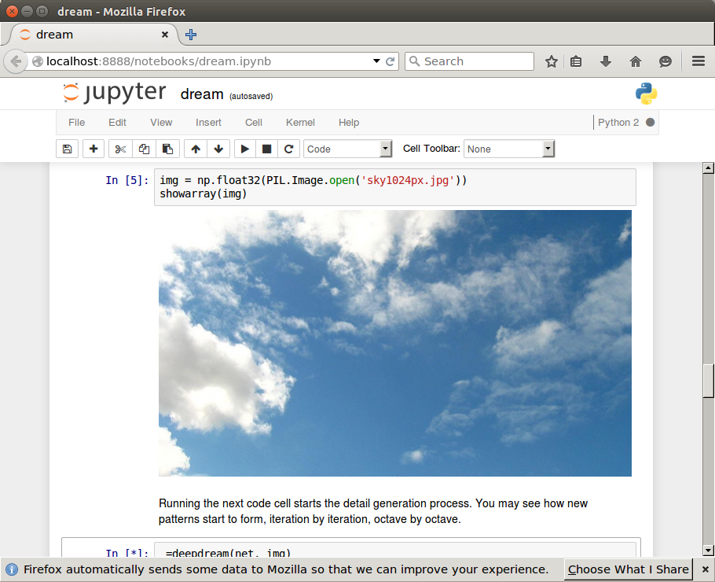

[Deep Dream in Docker - a Docker container for google/deepdream](https://github.com/NyaRuRu/deepdream-ipython-notebook)
===================================

This is a sample Docker file to run [google/deepdream](https://github.com/google/deepdream) in a portable Docker container with no dependency on GPU.  This work is based on [VISIONAI/clouddream](https://github.com/VISIONAI/clouddream).



How to Run
------------

### Download the container
```
docker pull nyaruru/deepdream-ipython-notebook
```

### Run the container
```
git clone https://github.com/NyaRuRu/deepdream-ipython-notebook.git
cd deepdream-ipython-notebook
./run_deepdream.sh
```
